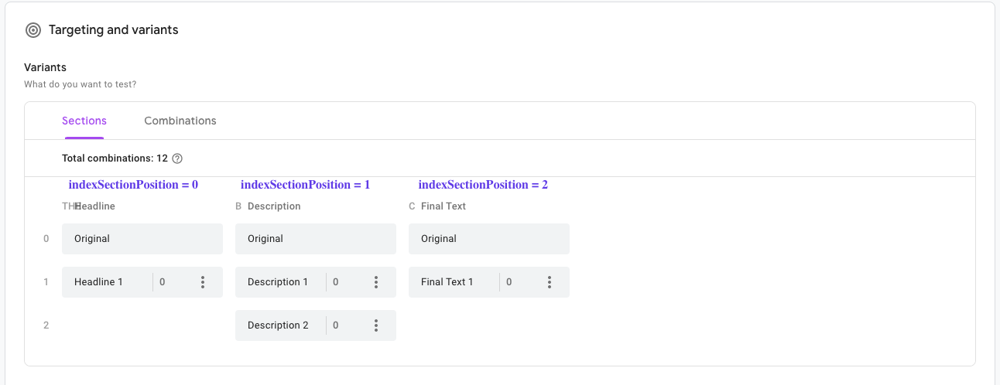

# react-optimize

<!-- ALL-CONTRIBUTORS-BADGE:START - Do not remove or modify this section -->
[](#contributors-)
<!-- ALL-CONTRIBUTORS-BADGE:END -->

[](https://github.com/hudovisk/react-optimize/actions) [](https://greenkeeper.io/)

Integration with Google Optimize.

Docs:

- Optimize Deploy with GTAG: https://support.google.com/optimize/answer/7513085
- Optimize JS API: https://support.google.com/optimize/answer/9059383

## Installation

```
yarn add react-optimize
```

You first need to add the gtag snippet with the optimize container id in it. If you are using [create-react-app](https://github.com/facebook/create-react-app)
you can add the following to `public/index.html`

```html
<script async src="https://www.googletagmanager.com/gtag/js?id=%REACT_APP_GA_ID%"></script>
<script>
  window.dataLayer = window.dataLayer || [];
  gtag = function () { dataLayer.push(arguments); }
  gtag("js", new Date());

  gtag("config", "%REACT_APP_GA_ID%", { "optimize_id": "%REACT_APP_OPTIMIZE_ID%"});
</script>
```

and define them in your `.env`

```
REACT_APP_GA_ID=UA-xyz
REACT_APP_OPTIMIZE_ID=GTM-abc
```

## How to use

#### A/B Test
If the experience is a **A/B testing** you can use the lib like the following:

```js
import React from "react";
import { Experiment, Variant } from "react-optimize";

class App extends React.Component {
  render() {
    return(
      <Experiment id="<experiment-id>">
        <Variant id="0">
          Original
        </Variant>
        <Variant id="1">
          Variant 1
        </Variant>
        <Variant id="2">
          Variant 2
        </Variant>
      </Experiment>
    )
  }
}
```

#### Multivariate Test
If the experience is a **multivariate testing** to test variants with two or more different sections. You can use the lib like the following applying the props **asMtvExperiment (confirm that is multivariate)** and the **indexSectionPosition** on google optimize like the image below:



```js
import React from "react";
import { Experiment, Variant } from "react-optimize";

class App extends React.Component {
  render() {
    return(
      <Experiment 
        id="<experiment-id>"
        asMtvExperiment
        indexSectionPosition="0"
      >
        <Variant id="0">
          Original
        </Variant>
        <Variant id="1">
          Variant 1
        </Variant>
      </Experiment>

      <Experiment 
        id="<experiment-id>"
        asMtvExperiment
        indexSectionPosition="1"
      >
        <Variant id="0">
          Original
        </Variant>
        <Variant id="1">
          Variant 1
        </Variant>
        <Variant id="2">
          Variant 2
        </Variant>
      </Experiment>

      <Experiment 
        id="<experiment-id>"
        asMtvExperiment
        indexSectionPosition="2"
      >
        <Variant id="0">
          Original
        </Variant>
        <Variant id="1">
          Variant 1
        </Variant>
      </Experiment>
    )
  }
}
```

## Contributors ✨

Thanks goes to these wonderful people ([emoji key](https://allcontributors.org/docs/en/emoji-key)):

<!-- ALL-CONTRIBUTORS-LIST:START - Do not remove or modify this section -->
<!-- prettier-ignore-start -->
<!-- markdownlint-disable -->
<table>
  <tr>
    <td align="center"><a href="https://github.com/hudovisk"><br /><sub><b>Hudo Assenco</b></sub></a><br /><a href="https://github.com/hudovisk/react-optimize/commits?author=hudovisk" title="Code">💻</a> <a href="https://github.com/hudovisk/react-optimize/commits?author=hudovisk" title="Documentation">📖</a></td>
    <td align="center"><a href="http://dobesv.com"><br /><sub><b>Dobes Vandermeer</b></sub></a><br /><a href="https://github.com/hudovisk/react-optimize/commits?author=dobesv" title="Code">💻</a> <a href="https://github.com/hudovisk/react-optimize/commits?author=dobesv" title="Documentation">📖</a></td>
    <td align="center"><a href="https://github.com/tlaak"><br /><sub><b>Timo Laak</b></sub></a><br /><a href="https://github.com/hudovisk/react-optimize/pulls?q=is%3Apr+reviewed-by%3Atlaak" title="Reviewed Pull Requests">👀</a></td>
    <td align="center"><a href="https://kelvinmaues.github.io/"><br /><sub><b>Kelvin Maues</b></sub></a><br /><a href="https://github.com/hudovisk/react-optimize/commits?author=kelvinmaues" title="Code">💻</a> <a href="https://github.com/hudovisk/react-optimize/commits?author=kelvinmaues" title="Documentation">📖</a></td>
  </tr>
</table>

<!-- markdownlint-restore -->
<!-- prettier-ignore-end -->
<!-- ALL-CONTRIBUTORS-LIST:END -->

This project follows the [all-contributors](https://github.com/all-contributors/all-contributors) specification. Contributions of any kind welcome!
